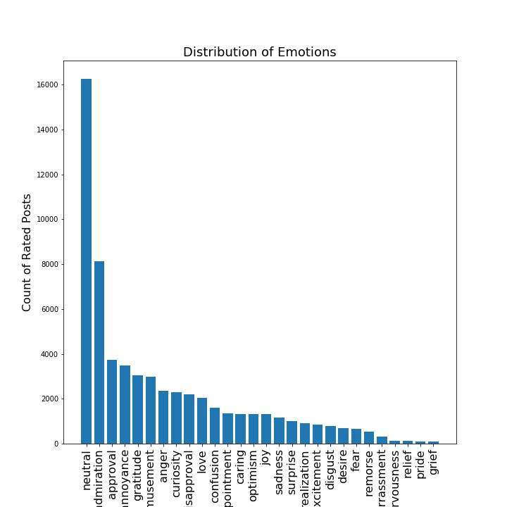
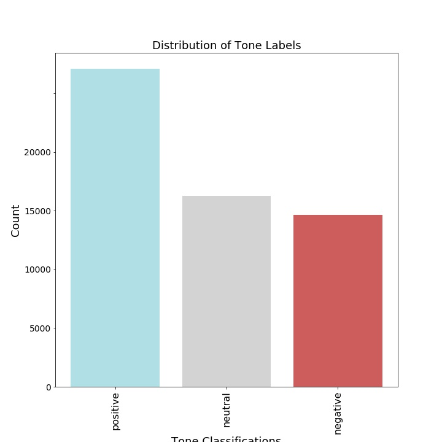
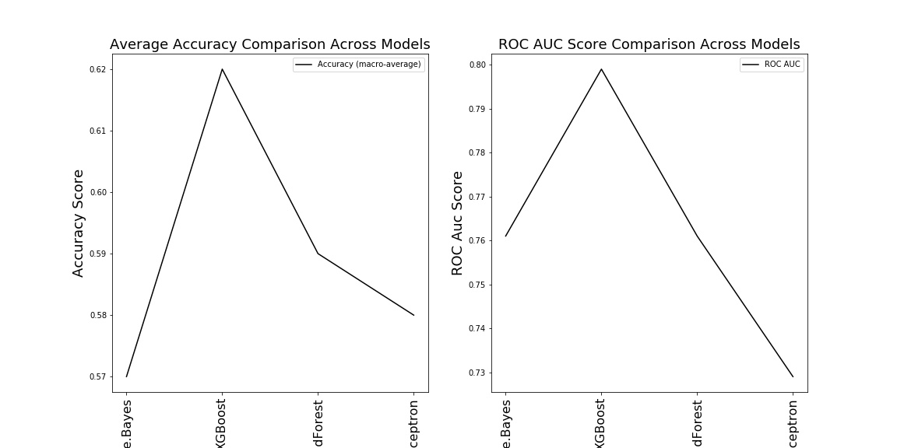
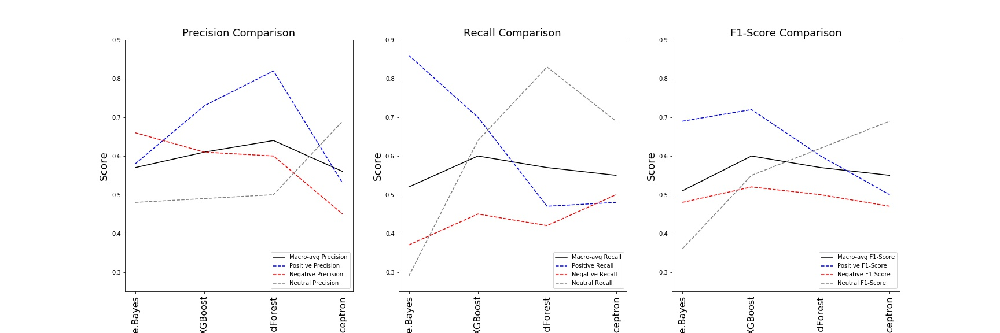
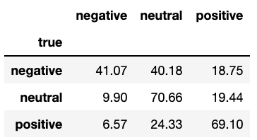
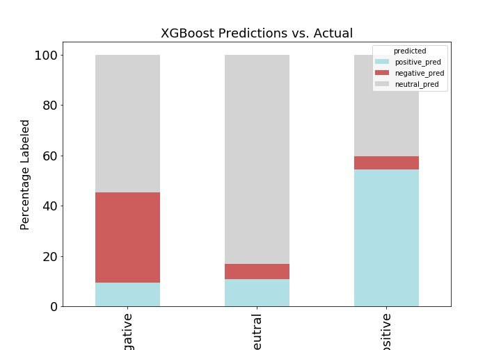
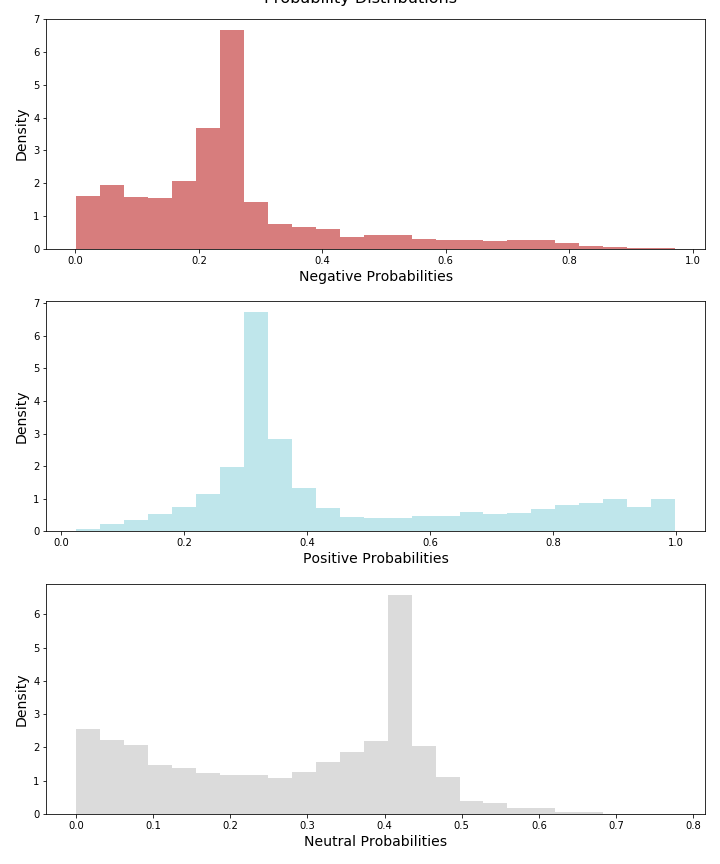
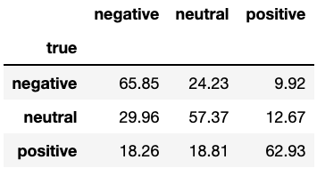
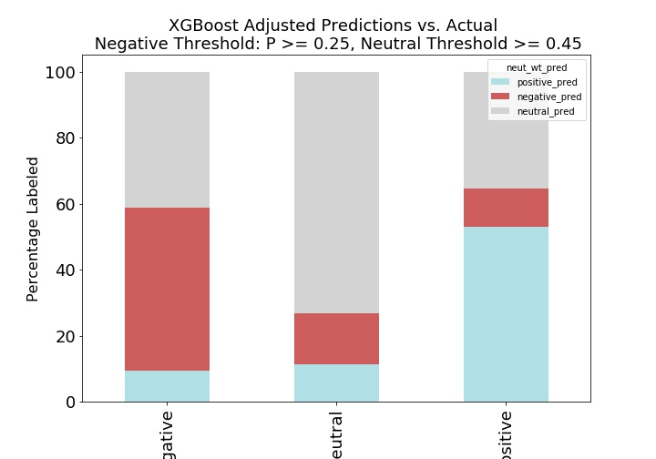

<<<<<<< HEAD
<<<<<<< HEAD
## Detecting Tone from Text
=======
### Detecting Tone from Text
>>>>>>> 2afa0e33ad18f72d141265e50adcd13464c6fee0

=======

## Detecting Tone from Text

>>>>>>> 06aaa14bc18638c980d33e36fbb6b86ee3cce37e
### About the Project

**Purpose**: Develop a model to correctly classify reddit comments as positive, negative, or neutral.  

[Link-to-Presentation](https://docs.google.com/presentation/d/1Lvom27soFB9eKbPO9tZ2nb7jR3V2DFrToR70LSyDsuE/edit?usp=sharing)


**Data Source**: The dataset came from a Google Research study called "Goemotions".  The data is comprised of 58,000 reddit comments that were labeled for 27 unique different emotions, including 'neutral'. 
[Link-to-original-study](https://github.com/google-research/google-research/tree/master/goemotions)


**About the Data**
Each comment in the original dataset was labeled for 27 emtions by multiple raters; on average, each comment was rated by 3-4 different people. Comments with zero ratings were dropped from the dataset.  The unique emotion labels for this analysis are simply the mode of the original ratings.  In cases where there was a tie, the first emotion was chosen.  This likely introduces bias into the emotion labels. However, the emotions were then reduced down to tone and labeled as positive, negative, or neutral.

<p align="center">
    
</p>

 
<p align="center">
    
</p>


### Pipeline


**Preparing the Data**
* *Cleaning*: Stop-words, punctuation, and non-alpha characters were removed from the data.

* *Lemmatization*: Lemmatization (nltk.wordnet.Lemmatizer) was used to reduce each each word to its meaning and consolidate like-meaning words.  

* *TF-IDF Vectorization*: TFIDF Vectorization was used to vectorize the words and weight their importance based on term and document frequencies.

* *Dimensionality Reduction*: The vectorized data started at about 28,000 features and each comment (observation) was reduced to an average of 6.5 words (post-cleaning). Before moving forward with the model exploration, I felt it necessary to reduce the number of dimensions.

  * TF-IDF Vectorization Max_Features: The max_features parameter was set to 5,000.  This means that the features were limited to the 5,000 most used words across the corpus. This captured 94.6% of the original weighted word frequencies (based on tf-idf weights).

  * Principal component analysis was explored but was not useful because each principal component had a very low contribution to total variance.  

  *  Non-negative Matrix Factorization was explored to see if there were any interesting groupings of words within the latent features.  A quick exploration of this can be found in at the end of the document.

**Model Comparison**

I chose to focus my exploration on the following multi-class classification algorithms, and used the following metrics for comparison:

* **Models**: Multinomial Naive Bayes, XGBoost Classifier, Random Forest Classifier, and Multilayer Perceptron

* **Comparison Metrics**: Accuracy, ROC AUC Score (one vs. rest)
*I also looked at individual Recall and Precision scores for each class (one-vs-rest) and their weighted average.*

Cross validation was used in both the tuning of hyperparameters and the training of the best resulting models. The scores reported are based on the predictions from unseen test data that were excluded from the training set.

The performance of each model is shown below.  XG Boost and Multilayer Perceptron performed best, with the highest Accuracy, and ROC AUC Scores. Random Forest was the next best alternative across metrics.  I chose to focus the rest of my training efforts on the XGBoost model.  However, with more time, I would like to further explore the use of neural networks.

Note: I tried all of the flavors of naive bayes, although multinomial is the most appropriate for TF-IDF matrices.  I am not sure why Bernoulli Naive Bayes performed so well, as my data was not binary.  I included the results here for further exploration.

<p align="center">
    
</p>

<p align="center">
    
</p>


**XGBoost Hyperparameters**
XGBoost hyperparameters were tuned using sklearn's RandomizedGridSearchCV.  The process* I followed for tuning is outlined below. N_estimators was re-opimized throughout the tunning cycles. 

1. N_estimators(initial): 300 
2. Max_depth (6) and min_child_weight (3) 
3. Gamma: 0.1
4. N_estimators(update):
5. Subsample (0.8) and colsample_bynode (0.5)
6. Regularization lambda (1)
7. Reduce learning rate (0.1)

Other parameters of note: objective = 'multi:softmax'

I gained a lot of knowledge aroung XGBoost hyperparameter tuning from this [blog post](https://www.analyticsvidhya.com/blog/2016/03/complete-guide-parameter-tuning-xgboost-with-codes-python/).


**XGBoost Performance**

#### *Limitations*

The model makes predictions based on whichever class has the highest predicted probability.  The model tended to over-predict neutral ratings and under-predict negative ratings; it incorrectly labeled true negatives and neutral. The model was best at predicting true positives.

**Confusion Matrix of XGBoost Performance (Percentages%)**

<p align="left">
    
</p>

<p align="left">
    
</p>

The distributions of the predicted probabilities of each class shed some light on why this is so. The majority of the negative predicted probabilities are below 0.3, meaning the model rarely had strong predictions for the negative class.  The predicted probabilities of the positive class spike around 0.3-0.4 and there is a fair amount of density above 0.8, where the model had strong predictions for the positive class.  The predicted probabilities of the neutral class, in contrast, show a large spike around the middle of the spectrum, where there is a relative absense of negative and positive predicted probabilities. Therefore, the neutral class is capturing the predictions in cases where there isn't a strong positive probability.

<p align="left">
    
</p>

The graph below shows the predicted probabilities for the neutral class vs. the negative class for **true negative labels only**. I chose to look at this because in many applications, it is very important to be able to filter out true negative comments (customer reviews, etc.).  It is worth exploring the effect of adjusting the negative prediction threshold in order to improve negative recall. The dashed vertical line (P(negative) = 0.25) is just an example of where the threshold could be moved. 

<p align="left">
    
</p>

Depending on what is most important to the user, it is worth exploring how adjusting thresholds may change the recall and precision of each class. The confusion matrix and graph below show how the model's performance changes when a different threshold is applied to the negative and neutral classes:
* If predicted probability of the negative class is above 0.25: predict "negative"
* If predicted probability of the neutral class is below 0.45: predict max(postive, negative)

<p align="left">
    
</p>
<p align="left">
    
</p>

**Other Interesting Findings**
Non-negative matrix factorization (k=20) was used to explore the most influential words within each latent feature. The top ten words within each latent feature are listed below.  Some groupings are very clearly positive or negative. I tried fitting models to the NMF-transformed data, however, the performance was very low.  It would be interesting to further explore whether these latent features have any relation to subreddit or the original coded emotions.

```
Latent Topic #1: ['name' 'damn' 'also' 'fucking' 'hate' 'need' 'best' 'fuck' 'game'
 'favorite']
Latent Topic #2: ['like' 'feel' 'sound' 'seems' 'something' 'dont' 'someone' 'felt' 'said'
 'lot']
Latent Topic #3: ['love' 'username' 'id' 'haha' 'hate' 'show' 'yes' 'kid' 'always' 'sub']
Latent Topic #4: ['would' 'never' 'someone' 'thought' 'wish' 'even' 'say' 'probably'
 'awesome' 'something']
Latent Topic #5: ['thank' 'sharing' 'cool' 'appreciate' 'awesome' 'try' 'ill' 'advice'
 'post' 'god']
Latent Topic #6: ['thanks' 'sharing' 'appreciate' 'nice' 'ok' 'info' 'advice' 'ah' 'hate'
 'okay']
Latent Topic #7: ['good' 'luck' 'job' 'pretty' 'hope' 'damn' 'idea' 'sound' 'point'
 'friend']
Latent Topic #8: ['get' 'hope' 'better' 'dont' 'need' 'help' 'could' 'back' 'still' 'let']
Latent Topic #9: ['oh' 'yeah' 'god' 'wow' 'boy' 'sorry' 'thought' 'fuck' 'shit' 'forgot']
Latent Topic #10: ['one' 'favorite' 'ever' 'day' 'thought' 'best' 'seen' 'least' 'actually'
 'every']
Latent Topic #11: ['lol' 'actually' 'yes' 'funny' 'even' 'said' 'comment' 'though' 'thought'
 'made']
Latent Topic #12: ['guy' 'want' 'actually' 'nice' 'poor' 'hate' 'ca' 'cool' 'pretty' 'said']
Latent Topic #13: ['know' 'dont' 'even' 'didnt' 'want' 'mean' 'let' 'anyone' 'everyone'
 'care']
Latent Topic #14: ['think' 'dont' 'mean' 'way' 'something' 'anyone' 'still' 'agree' 'say'
 'best']
Latent Topic #15: ['look' 'pretty' 'damn' 'face' 'even' 'cool' 'picture' 'dude' 'going'
 'amazing']
Latent Topic #16: ['people' 'hate' 'need' 'many' 'want' 'lot' 'always' 'way' 'understand'
 'problem']
Latent Topic #17: ['really' 'wow' 'hope' 'actually' 'need' 'want' 'mean' 'thought' 'sad'
 'never']
Latent Topic #18: ['got' 'ta' 'thought' 'damn' 'back' 'never' 'someone' 'game' 'youve'
 'something']
Latent Topic #19: ['im' 'sorry' 'glad' 'sure' 'going' 'na' 'youre' 'gon' 'dont' 'friend']
Latent Topic #20: ['make' 'sense' 'feel' 'even' 'want' 'sure' 'happy' 'better' 'way' 'sad']

```


**Next Steps**

* Explore the use of neural networks for this problem, specifically RNN and 1D-CNN

* Test model on original 27 emotion labels

* Investigate whether text can be used to predict subreddits
<<<<<<< HEAD
=======

>>>>>>> 06aaa14bc18638c980d33e36fbb6b86ee3cce37e


